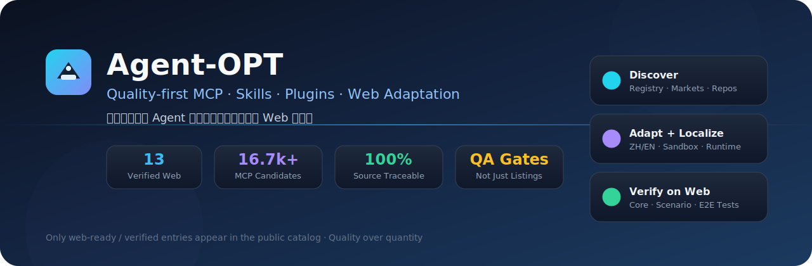

<div align="center">


# Agent-OPT

### 质量优先的 Agent 技能 / 插件 / MCP 聚合与 Web 适配平台  
### Quality-first aggregator & Web adaptation platform for agent skills, plugins, and MCP servers

[](LICENSE)
[](https://nextjs.org/)
[](https://www.typescriptlang.org/)
[](#-verified-public-catalog--公开目录事实)
[](#-verified-public-catalog--公开目录事实)
[](#-verified-public-catalog--公开目录事实)
[](https://github.com/Bozheng-Li/AGRNT-OPT/stargazers)

[English](#-english) · [中文](#-中文) · [Docs](docs/) · [Catalog](catalog/plugins/) · [Issues](https://github.com/Bozheng-Li/AGRNT-OPT/issues)

<br/>

[](https://render.com/deploy?repo=https://github.com/Bozheng-Li/AGRNT-OPT)
&nbsp;
[](https://github.com/Bozheng-Li/AGRNT-OPT)
&nbsp;
[](#-quick-start--快速开始)

<br/>



</div>

---

## ⚠️ 数字怎么读（先对齐事实）

本仓库严格区分 **发现层** 与 **正式公开集成**：

| 口径 | 当前真实数字 | 来源 | 能否算“已集成” |
|:--|--:|:--|:--|
| 公开 Web 适配（`web-ready` / `verified`） | **115** | `catalog/plugins/*.json` | ✅ 是 |
| 其中 MCP 运行时工作台 | **55** | `kind=mcp-server` | ✅ 是（13 上游 stdio + 42 一等公民进程内本地 MCP） |
| 其中 Agent Skill 工作室 | **60** | `kind=agent-skill` | ✅ 是（官方正文入库 + Skill 工作室 + 测试） |
| 官方 MCP Registry 最新候选 | **16,765** | `var/snapshots/official-mcp-registry/latest-candidates.json` | ❌ 仅发现 |
| MCP 全量版本记录（一次完整同步） | **51,937** / **520** 页 | `var/.../checkpoint.json` | ❌ 仅发现 |
| 结构化市场清单 | **2,428** | `var/snapshots/structured-marketplaces/latest-candidates.json` | ❌ 仅发现 |
| 路径级 skill 候选 | **620** | `var/snapshots/official-skill-repositories/latest-candidates.json` | ❌ 仅发现 |
| 资格审查队列 | **250** | `var/analysis/official-mcp-ranked.json` | ❌ 仍为 `discovered` |

> **翻译元数据 ≠ 已集成。**  
> 发现层数字可以很大；公开目录只放通过质量门禁、有专属 Web、有验证证据的条目。

---

## 🌐 Language / 语言

| | |
|:--|:--|
| 🇨🇳 **中文** | [向下阅读完整中文说明](#-中文) |
| 🇺🇸 **English** | [Jump to full English section](#-english) |

---

<a id="-中文"></a>

# 🇨🇳 中文

## ✨ 项目在做什么

Agent-OPT 不是“堆 MCP 链接”的目录站，而是：

1. **发现**：同步官方 MCP Registry、结构化市场、官方 skill 仓库  
2. **筛选**：来源 / 许可证 / 安全 / 实用性  
3. **适配**：可运行的 runtime 或 skill 文档运行时  
4. **Web**：每个正式项目独立工作台  
5. **验证**：核心 / 场景 / 失败 / Web 证据  

生命周期：

```text
discovered → qualified → translated → adapted → web-ready → verified
                              ↘ blocked / deprecated
```

只有 `web-ready` 与 `verified` 会出现在公开插件中心。

---

## 📊 公开目录事实

当前公开 **115** 个：

- **55** 个 **MCP**  
  - **13** 上游 stdio MCP（Node/Python 子进程 + 专属工作台）  
  - **42** 一等公民进程内本地 MCP（`local-*`，无外网 / 无凭证，专属表单 Web）  
- **60** 个 **Agent Skill**（官方 SKILL.md 入库 + Skill 工作室：章节 / 检索 / 全文）

> 本地 MCP 明确标注为 Agent-OPT first-party `in-process` 工具面，**不是**把第三方 Registry 条目直接标 verified。

### 上游 MCP 工作台（13）

| 中文名 | 英文名 | 评分 | 路由 |
|:--|:--|--:|:--|
| Svelte 开发工作室 | Svelte MCP | 92 | `/plugins/svelte-development-studio` |
| Blueprint 数据图表工作台 | Blueprint Chart | 91 | `/plugins/blueprint-chart-studio` |
| 文件系统工作台 | Filesystem MCP Server | 91 | `/plugins/filesystem-workbench` |
| oxidize-pdf 文档工作台 | oxidize-pdf MCP Server | 90 | `/plugins/oxidize-pdf-workbench` |
| 世界时间与时区换算 | Time MCP Server | 90 | `/plugins/timezone-converter` |
| BumpGuard 依赖兼容实验室 | BumpGuard | 89 | `/plugins/bumpguard-dependency-lab` |
| Git 沙箱工作室 | Git MCP Server | 88 | `/plugins/git-sandbox-studio` |
| 确定性文本去冗器 | defluff | 88 | `/plugins/prose-defluffer` |
| 知识图谱记忆库 | Knowledge Graph Memory Server | 87 | `/plugins/knowledge-memory` |
| Mermaid 图表工作室 | Agentic Mermaid | 87 | `/plugins/mermaid-diagram-studio` |
| SQLite 数据工作台 | SQLite MCP Server | 87 | `/plugins/sqlite-workbench` |
| 网页正文读取器 | Fetch MCP Server | 85 | `/plugins/web-content-reader` |
| 结构化思考工作室 | Sequential Thinking MCP Server | 79 | `/plugins/sequential-thinking-studio` |

### 本地 MCP 工具面（42）

路由形如 `/plugins/local-json-lab`、`/plugins/local-hash-lab`…  
实现：`src/lib/runtime/local-mcp-tools.ts` + `LocalMcpWorkspace`。  
覆盖 JSON/YAML/CSV、Base64、Hash、UUID、URL、Regex、Cron、SemVer、单位换算、安全算术等确定性本地工具。

### Agent Skill 工作室（60）

来源：Anthropic 官方 skills（Apache-2.0）+ OpenAI plugins 路径级 skills（MIT）。  
运行方式：`in-process` 文档运行时，**不执行**上游脚本，**不**假装成 MCP stdio。  
下表仅列部分代表；完整列表见 [`catalog/plugins/`](catalog/plugins/)（`skill-*.json`）。

| 中文名 | 原名 | 来源 | 路由 |
|:--|:--|:--|:--|
| MCP 服务构建指南 | mcp-builder | Anthropic | `/plugins/skill-mcp-builder` |
| 前端视觉设计指南 | frontend-design | Anthropic | `/plugins/skill-frontend-design` |
| Skill 创作与评测 | skill-creator | Anthropic | `/plugins/skill-skill-creator` |
| 算法艺术创作指南 | algorithmic-art | Anthropic | `/plugins/skill-algorithmic-art` |
| 画布视觉设计指南 | canvas-design | Anthropic | `/plugins/skill-canvas-design` |
| Web 应用测试手册 | webapp-testing | Anthropic | `/plugins/skill-webapp-testing` |
| 品牌视觉规范应用 | brand-guidelines | Anthropic | `/plugins/skill-brand-guidelines` |
| Web 产物构建套件 | web-artifacts-builder | Anthropic | `/plugins/skill-web-artifacts-builder` |
| 内部沟通文案模板 | internal-comms | Anthropic | `/plugins/skill-internal-comms` |
| 主题样式工厂 | theme-factory | Anthropic | `/plugins/skill-theme-factory` |
| Slack GIF 创作规范 | slack-gif-creator | Anthropic | `/plugins/skill-slack-gif-creator` |
| 数据可视化选型指南 | data-visualization | OpenAI plugins | `/plugins/skill-data-visualization` |
| 无访问数据可视化 | accessibility-and-inclusive-visualization | OpenAI plugins | `/plugins/skill-accessibility-and-inclusive-visualization` |
| 结构化头脑风暴 | brainstorming | OpenAI plugins | `/plugins/skill-brainstorming` |
| D3 数据可视化指南 | d3-data-visualization | OpenAI plugins | `/plugins/skill-d3-data-visualization` |
| Canvas2D 可视化指南 | canvas2d-data-visualization | OpenAI plugins | `/plugins/skill-canvas2d-data-visualization` |
| 仪表盘与实时可视化 | dashboards-and-real-time-visualization | OpenAI plugins | `/plugins/skill-dashboards-and-real-time-visualization` |
| Expo 原生 UI 构建 | building-native-ui | OpenAI plugins | `/plugins/skill-building-native-ui` |
| Cloudflare AI Agent 构建 | building-ai-agent-on-cloudflare | OpenAI plugins | `/plugins/skill-building-ai-agent-on-cloudflare` |
| CircleCI 配置优化 | circleci-config | OpenAI plugins | `/plugins/skill-circleci-config` |
| CircleCI 构建排障 | circleci-builds | OpenAI plugins | `/plugins/skill-circleci-builds` |
| SwiftUI 界面模式 | swiftui-ui-patterns | OpenAI plugins | `/plugins/skill-swiftui-ui-patterns` |
| SwiftUI 视图重构 | swiftui-view-refactor | OpenAI plugins | `/plugins/skill-swiftui-view-refactor` |
| SwiftUI 与 AppKit 互通 | appkit-interop | OpenAI plugins | `/plugins/skill-appkit-interop` |
| Airtable 数据模型概览 | airtable-overview | OpenAI plugins | `/plugins/skill-airtable-overview` |
| Airtable 过滤语法 | airtable-filters | OpenAI plugins | `/plugins/skill-airtable-filters` |
| 代码审查工作流 | code-review | OpenAI plugins | `/plugins/skill-code-review` |
| 引用与脚注规范 | citations | OpenAI plugins | `/plugins/skill-citations` |

---

## 🚀 快速开始

### 公网一键部署

[](https://render.com/deploy?repo=https://github.com/Bozheng-Li/AGRNT-OPT)

部署后打开站点首页 = **插件中心**（115 个卡片），点 **打开 Web** 进入对应工作台。

> 这是 Next.js + MCP/Skill 运行时，**不是**静态站；GitHub Pages 无法直接跑完整插件中心。

### 本地开发

```powershell
npm install
pip install -r requirements-mcp.txt
npm run runtime:setup:bumpguard   # 仅 BumpGuard 需要
npm run catalog:validate
npm run dev
```

打开 **http://localhost:3000**

### Docker

```powershell
docker compose up --build
```

---

## 🖥️ 如何查看全部 Web

1. 打开首页 `http://localhost:3000`（或 Render URL）  
2. 搜索 / 分类筛选  
3. 点卡片 **打开 Web**  
4. MCP 走真实工具调用；Skill 走章节大纲 / 检索 / 全文  

清单文件：[`catalog/plugins/`](catalog/plugins/)  
Skill 正文副本：[`catalog/skill-bodies/`](catalog/skill-bodies/)

---

## 🏗️ 架构

```text
Web UI (Next.js)
  └─ POST /api/plugins/[slug]/invoke
       ├─ MCP stdio adapters     → Node/Python upstream MCP (13)
       ├─ Local MCP in-process   → local-mcp-tools.ts (42)
       └─ Skill in-process       → catalog/skill-bodies/* (60)
```

| 目录 | 用途 |
|:--|:--|
| `catalog/plugins/` | 正式清单（唯一公开真相源） |
| `catalog/skill-bodies/` | Skill 正文与许可证副本 |
| `src/lib/runtime/` | MCP / Skill 适配与沙箱 |
| `src/components/workspaces/` | 专属 Web 工作台 |
| `var/` | 发现快照（不提交，不可当产品数） |

---

## 🔁 质量命令

```powershell
npm run catalog:validate
npm run typecheck
npm run lint
npm test
npm run build
npm run test:e2e   # Web 行为变更时
```

---

## 🔐 不可妥协规则

- 不能把“只翻译了元数据”算集成  
- 不能在缺凭证/付费/硬件/区域条件时强行 `verified`  
- 公开页只展示 `web-ready` / `verified`  
- Skill 与 MCP 分开计数，不混称  
- 证据优先：官方结构化 API → 官方仓库 → 官方市场 → 可信研究  

详见：[`docs/PRODUCT_CHARTER.md`](docs/PRODUCT_CHARTER.md) · [`docs/QUALITY_GATES.md`](docs/QUALITY_GATES.md) · [`AGENTS.md`](AGENTS.md)

---

## 🛣️ 扩展计划（诚实版）

目标是继续把公开目录扩到更多“几十个→上百个”，但**不会**把 16,765 个 MCP 候选直接上架：

1. 从 250 条资格审查队列里做许可证 + 无凭证 + 本地可运行筛选  
2. 每批新增 MCP 必须有 adapter + 专属 Web + 真实测试  
3. 继续从 620 条 skill 候选中收录纯文档 / 可安全展示的 skill  
4. 需要密钥或外部账号的条目保持 `blocked` / `discovered`，写清阻塞原因  

---

## 📄 许可证

平台代码见 [LICENSE](LICENSE)。上游 MCP / skill 保留各自许可证；本仓库优先适配调用，不擅自拷贝受限实现。

---

<a id="-english"></a>

# 🇺🇸 English

## What this repo is

Agent-OPT is a **quality-first** platform that discovers agent skills / plugins / MCP servers, localizes them, adapts them to a runtime, ships a dedicated Web workspace, and records real verification.

It deliberately separates:

- **Discovery coverage** (large, under `var/`)  
- **Formal public integrations** (small, under `catalog/plugins/`)

## Facts (measured from this workspace)

| Metric | Value | Counts as integrated? |
|:--|--:|:--|
| Public Web entries | **115** | Yes |
| Verified MCP surfaces | **55** (13 upstream stdio + 42 first-party local in-process) | Yes |
| Verified agent skills | **60** | Yes |
| MCP registry latest candidates | **16,765** | No |
| MCP version records in full sync | **51,937** across **520** pages | No |
| Structured marketplace listings | **2,428** | No |
| Path-addressed skill candidates | **620** | No |
| Qualification review queue | **250** still `discovered` | No |

## Public catalog

- **55 MCP surfaces**: 13 upstream stdio adapters + 42 first-party local in-process MCP tools with dedicated Web forms  
- **60 skill studios**: curated official `SKILL.md` bodies with section outline, search, full-text viewer; **scripts are not executed**

Open `http://localhost:3000` after `npm run dev`, or deploy via the Render button above. The homepage is the plugin center; each card’s **Open Web** route is `/plugins/<slug>`.

## Quick start

```powershell
npm install
pip install -r requirements-mcp.txt
npm run runtime:setup:bumpguard
npm run catalog:validate
npm run dev
```

Required checks before claiming completeness:

```powershell
npm run catalog:validate
npm run typecheck
npm run lint
npm test
npm run build
npm run test:e2e
```

## Non-negotiables

- Metadata translation alone is **not** integration  
- Never mark `verified` when credentials/paid access/hardware/region/service blocked the test  
- Public pages only expose `web-ready` / `verified`  
- Do not blur MCP counts with skill counts  
- Preserve provenance, original text, Chinese labels, license evidence, and verification evidence  

## License

See [LICENSE](LICENSE). Upstream packages keep their own licenses.

---

<div align="center">

**Agent-OPT** · Quality first · Honest counts · Continuously expanding

Public now: **115** · MCP: **55** · Skills: **60** · Discovery: much larger under `var/`

[⬆ Back to top](#agent-opt)

</div>
