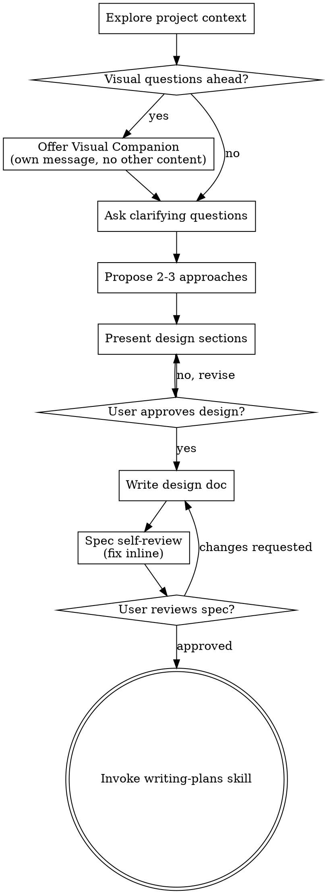

# 将头脑风暴中的想法转化为设计

通过自然的协作式对话，帮助把想法转化为完整成形的设计和规格说明。

先了解当前项目上下文，然后每次只问一个问题来逐步完善想法。一旦理解要构建什么，就展示设计并取得用户批准。

<HARD-GATE>
在展示设计并获得用户批准之前，不要调用任何实现技能、编写任何代码、搭建任何项目，也不要采取任何实现行动。无论项目看起来多么简单，此规则都适用于每一个项目。
</HARD-GATE>

## 反模式：“这太简单了，不需要设计”

每个项目都要经过这个流程。待办清单、单函数工具、配置更改——无一例外。“简单”项目最容易因未经审视的假设造成最多返工。设计可以很短（对于真正简单的项目，几句话即可），但你必须展示设计并获得批准。

## 检查清单

你必须为以下每一项创建任务，并按顺序完成：

1. **探索项目上下文**——检查文件、文档、最近的提交
2. **提供视觉辅助工具**（如果主题会涉及视觉问题）——这必须是一条独立消息，不能与澄清问题合并。参见下方“视觉辅助工具”章节。
3. **提出澄清问题**——每次一个，了解目的/约束/成功标准
4. **提出 2–3 种方案**——说明权衡及你的建议
5. **展示设计**——按复杂度分节展示，每节后获取用户批准
6. **编写设计文档**——保存到 `docs/superpowers/specs/YYYY-MM-DD-<topic>-design.md` 并提交
7. **规格说明自审**——快速行内检查占位符、矛盾、歧义和范围（见下文）
8. **用户审查书面规格说明**——继续之前，请用户审查规格说明文件
9. **转入实现阶段**——调用 writing-plans 技能创建实现计划

## 流程图

**终止状态是调用 writing-plans。** 不要调用 frontend-design、mcp-builder 或任何其他实现技能。头脑风暴之后，你唯一要调用的技能是 writing-plans。

## 流程详解

**理解想法：**

- 首先检查当前项目状态（文件、文档、最近的提交）
- 在提出详细问题之前，先评估范围：如果请求描述了多个独立子系统（例如“构建一个包含聊天、文件存储、计费和分析的平台”），应立即指出这一点。不要花时间追问一个本应先拆分的项目细节。
- 如果项目过大，无法放入一份规格说明，请帮助用户将其拆分为子项目：哪些部分彼此独立、它们如何关联、应按什么顺序构建？然后按照正常设计流程，对第一个子项目进行头脑风暴。每个子项目都各自经历规格说明 → 计划 → 实现的周期。
- 对范围适当的项目，每次只问一个问题来完善想法
- 尽可能优先使用选择题，但开放式问题也可以
- 每条消息只问一个问题——如果一个主题需要深入探索，请拆成多个问题
- 专注于理解：目的、约束、成功标准

**探索方案：**

- 提出 2–3 种不同方案，并说明权衡
- 以对话方式展示选项，同时给出你的建议和理由
- 先给出你推荐的选项，并解释原因

**展示设计：**

- 当你确信已理解要构建什么时，展示设计
- 每节长度应匹配其复杂度：内容简单时用几句话；细节微妙时可达 200–300 字
- 每节之后询问目前看来是否正确
- 覆盖：架构、组件、数据流、错误处理、测试
- 如果某些内容不合理，随时准备返回并澄清

**为隔离性和清晰度而设计：**

- 将系统拆分为更小的单元；每个单元只有一个明确目的，通过定义良好的接口通信，并且可以独立理解和测试
- 对每个单元，你都应能回答：它做什么、如何使用、依赖什么？
- 能否不阅读单元内部实现就理解其作用？能否更改内部实现而不破坏使用者？如果不能，说明边界需要改进。
- 小型且边界清晰的单元也更便于你处理——你对能一次装入上下文的代码推理得更好，文件职责专一时编辑也更可靠。文件变得很大时，通常意味着它承担了过多职责。

**在现有代码库中工作：**

- 提出更改前先探索当前结构。遵循现有模式。
- 如果现有代码存在影响工作的难题（例如文件变得过大、边界不清、职责纠缠），应把有针对性的改进纳入设计——优秀开发者会改进自己正在处理的代码。
- 不要提出无关的重构。专注于服务当前目标的内容。

## 设计之后

**文档：**

- 将经过验证的设计（规格说明）写入 `docs/superpowers/specs/YYYY-MM-DD-<topic>-design.md`
  - （用户对规格说明位置的偏好优先于此默认值）
- 如果 elements-of-style:writing-clearly-and-concisely 技能可用，请使用它
- 将设计文档提交到 git

**规格说明自审：**
写完规格说明文档后，以全新视角审视它：

1. **占位符扫描：** 是否存在任何“TBD”“TODO”、未完成章节或模糊要求？修复它们。
2. **内部一致性：** 各章节是否互相矛盾？架构是否与功能描述一致？
3. **范围检查：** 内容是否足够聚焦，可以形成一份实现计划，还是需要拆分？
4. **歧义检查：** 是否有要求可能被用两种不同方式解读？如果有，选择一种并明确说明。

就地修复所有问题。无需重新审查——修复后继续即可。

**用户审查门槛：**
规格说明审查循环通过后，请用户先审查书面规格说明再继续：

> “规格说明已写好并提交至 `<path>`。请审查该文件，并告诉我在开始编写实现计划之前是否需要做任何更改。”

等待用户回复。如果用户请求更改，请完成修改并重新运行规格说明审查循环。只有用户批准后才能继续。

**实现：**

- 调用 writing-plans 技能创建详细实现计划
- 不要调用任何其他技能。下一步是 writing-plans。

## 关键原则

- **每次一个问题**——不要用多个问题压垮用户
- **优先选择题**——在可行时，选择题比开放式问题更容易回答
- **坚决遵循 YAGNI**——从所有设计中移除不必要的功能
- **探索替代方案**——确定方案前始终提出 2–3 种方法
- **渐进式验证**——展示设计，在继续前获得批准
- **保持灵活**——遇到不合理之处时返回并澄清

## 视觉辅助工具

这是一个基于浏览器的辅助工具，用于在头脑风暴过程中展示模型图、图示和视觉选项。它作为工具提供，而不是一种模式。接受该辅助工具意味着它可用于适合视觉呈现的问题；并不意味着每个问题都要通过浏览器处理。

**提供辅助工具：** 当你预期接下来的问题会涉及视觉内容（模型图、布局、图示）时，只提供一次并征得同意：
> “我们正在处理的一些内容，如果能在 Web 浏览器中展示，可能会更容易说明。我可以在过程中制作模型图、图示、对比图和其他视觉内容。此功能仍然较新，可能会消耗较多 token。想试试吗？（需要打开本地 URL）”

**此提议必须单独作为一条消息。** 不得与澄清问题、上下文摘要或任何其他内容合并。消息只能包含上述提议，不能有其他内容。等待用户回复后再继续。如果用户拒绝，则以纯文本方式继续头脑风暴。

**逐个问题决定：** 即使用户接受了辅助工具，也要针对每一个问题决定使用浏览器还是终端。判断标准是：**让用户看到内容是否比阅读文字更容易理解？**

- **使用浏览器**处理本质上属于视觉内容的事项——模型图、线框图、布局对比、架构图、并排视觉设计
- **使用终端**处理本质上属于文本内容的事项——需求问题、概念选择、权衡清单、A/B/C/D 文本选项、范围决策

问题涉及 UI 主题，并不自动意味着它是视觉问题。“在此语境中，个性是什么意思？”是概念问题——使用终端。“哪一种向导布局效果更好？”是视觉问题——使用浏览器。

如果用户同意使用辅助工具，请在继续前阅读详细指南：
`skills/brainstorming/visual-companion.md`
