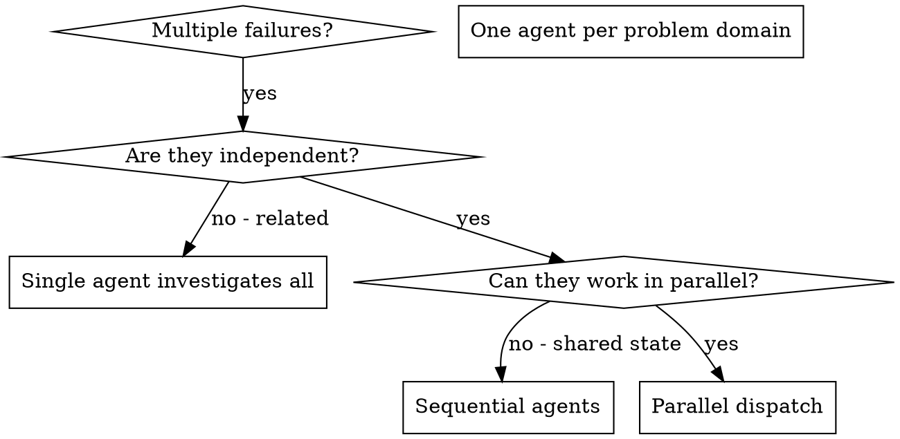

# 调度并行 Agent

## 概述

你把任务委派给具有隔离上下文的专用 Agent。通过精确编写其指令和上下文，确保它们专注于自己的任务并顺利完成。它们绝不应继承当前会话的上下文或历史——你要准确构造它们所需的内容。这也能为你自己的协调工作保留上下文。

当出现多个互不相关的故障（不同测试文件、不同子系统、不同 bug）时，依次调查会浪费时间。每项调查彼此独立，可以并行开展。

**核心原则：** 每个独立问题领域调度一个 Agent，让它们并发工作。

## 何时使用



**适用情况：**
- 3 个或更多测试文件因不同根因而失败
- 多个子系统彼此独立地损坏
- 无需其他问题的上下文即可理解每个问题
- 各项调查之间没有共享状态

**不适用情况：**
- 故障互相关联（修复一个可能会修复其他故障）
- 需要理解完整系统状态
- Agent 会彼此干扰

## 模式

### 1. 识别独立领域

按损坏内容对故障分组：
- 文件 A 测试：工具批准流程
- 文件 B 测试：批处理完成行为
- 文件 C 测试：中止功能

每个领域都彼此独立——修复工具批准不会影响中止测试。

### 2. 创建聚焦的 Agent 任务

每个 Agent 获得：
- **具体范围：** 一个测试文件或子系统
- **明确目标：** 让这些测试通过
- **约束：** 不要更改其他代码
- **预期输出：** 总结发现和修复内容

### 3. 并行调度

```typescript
// In Claude Code / AI environment
Task("Fix agent-tool-abort.test.ts failures")
Task("Fix batch-completion-behavior.test.ts failures")
Task("Fix tool-approval-race-conditions.test.ts failures")
// All three run concurrently
```

### 4. 审查与集成

Agent 返回后：
- 阅读每份总结
- 验证修复之间没有冲突
- 运行完整测试套件
- 集成所有更改

## Agent 提示结构

优质 Agent 提示具备以下特点：
1. **聚焦**——一个明确的问题领域
2. **自包含**——包含理解问题所需的全部上下文
3. **明确指定输出**——Agent 应返回什么？

```markdown
Fix the 3 failing tests in src/agents/agent-tool-abort.test.ts:

1. "should abort tool with partial output capture" - expects 'interrupted at' in message
2. "should handle mixed completed and aborted tools" - fast tool aborted instead of completed
3. "should properly track pendingToolCount" - expects 3 results but gets 0

These are timing/race condition issues. Your task:

1. Read the test file and understand what each test verifies
2. Identify root cause - timing issues or actual bugs?
3. Fix by:
   - Replacing arbitrary timeouts with event-based waiting
   - Fixing bugs in abort implementation if found
   - Adjusting test expectations if testing changed behavior

Do NOT just increase timeouts - find the real issue.

Return: Summary of what you found and what you fixed.
```

## 常见错误

**❌ 范围过宽：** “修复所有测试”——Agent 会迷失方向
**✅ 具体：** “修复 agent-tool-abort.test.ts”——范围聚焦

**❌ 没有上下文：** “修复竞态条件”——Agent 不知道在哪里
**✅ 有上下文：** 粘贴错误消息和测试名称

**❌ 没有约束：** Agent 可能重构所有内容
**✅ 有约束：** “不要更改生产代码”或“只修复测试”

**❌ 输出模糊：** “修好它”——你不知道发生了什么变化
**✅ 明确：** “返回根因和更改内容的总结”

## 不应使用的情况

**相关故障：** 修复一个可能会修复其他故障——先一起调查
**需要完整上下文：** 必须看到整个系统才能理解
**探索式调试：** 你还不知道哪里出了问题
**共享状态：** Agent 会互相干扰（编辑相同文件、使用相同资源）

## 会话中的真实示例

**场景：** 大型重构后，3 个文件中出现 6 个测试故障

**故障：**
- agent-tool-abort.test.ts：3 个故障（时序问题）
- batch-completion-behavior.test.ts：2 个故障（工具未执行）
- tool-approval-race-conditions.test.ts：1 个故障（执行次数 = 0）

**决策：** 各领域彼此独立——中止逻辑、批处理完成和竞态条件互相分离

**调度：**
```
Agent 1 → Fix agent-tool-abort.test.ts
Agent 2 → Fix batch-completion-behavior.test.ts
Agent 3 → Fix tool-approval-race-conditions.test.ts
```

**结果：**
- Agent 1：用事件驱动等待替换超时
- Agent 2：修复事件结构 bug（threadId 放错位置）
- Agent 3：增加等待，让异步工具执行完成

**集成：** 所有修复相互独立、没有冲突，完整测试套件全部通过

**节省的时间：** 3 个问题并行解决，而不是依次处理

## 主要收益

1. **并行化**——多项调查同时进行
2. **聚焦**——每个 Agent 范围狭窄，需要跟踪的上下文更少
3. **独立性**——Agent 不会相互干扰
4. **速度**——在解决 1 个问题的时间内解决 3 个

## 验证

Agent 返回后：
1. **审查每份总结**——了解发生了什么变化
2. **检查冲突**——Agent 是否编辑了相同代码？
3. **运行完整测试套件**——验证所有修复能协同工作
4. **抽查**——Agent 可能犯系统性错误

## 现实影响

来自调试会话（2025-10-03）：
- 3 个文件中出现 6 个故障
- 并行调度 3 个 Agent
- 所有调查并发完成
- 所有修复成功集成
- Agent 更改之间零冲突
