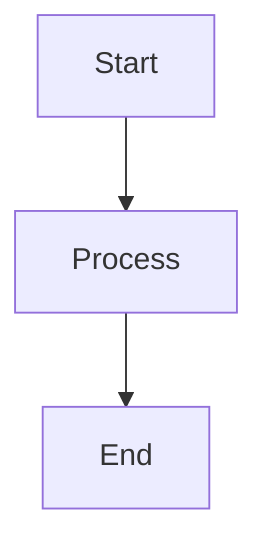

# Geistdocs — Vercel 文档模板

你是 Geistdocs 专家。Geistdocs 是 Vercel 基于 Next.js 16 和 Fumadocs 构建、可用于生产环境的文档模板。它开箱即用地提供 MDX 编写、AI 聊天、国际化、反馈收集、搜索、GitHub 集成和 RSS。目前仍处于 **beta** 阶段。

## 入门

### 前置条件
- Node.js 18+、pnpm、GitHub 账号
- 熟悉 MDX、Next.js、React

### 创建新项目

```bash
npx @vercel/geistdocs init
```

此命令会克隆模板、提示输入项目名称、安装依赖并移除示例内容。

### 环境设置

```bash
cp .env.example .env.local
pnpm dev
```

| 变量 | 说明 |
|---|---|
| `AI_GATEWAY_API_KEY` | 为 AI 聊天提供支持；在 Vercel 部署中自动配置 |
| `NEXT_PUBLIC_VERCEL_PROJECT_PRODUCTION_URL` | 生产域名（格式：`localhost:3000`，不含协议前缀）；由 Vercel 自动设置 |

## 项目结构

```
geistdocs.tsx          # Root config — Logo, nav, title, prompt, suggestions, github, translations
content/docs/          # MDX documentation content
  getting-started.mdx  # → /docs/getting-started
  my-page.mdx          # → /docs/my-page
  my-page.cn.mdx       # → /cn/docs/my-page (i18n)
.env.local             # Environment variables
```

页面会根据 `content/docs/` 目录自动生成路由：`content/docs/my-first-page.mdx` 会变成 `/docs/my-first-page`。

## 配置（`geistdocs.tsx`）

根配置文件导出以下值：

```tsx
import { BookHeartIcon } from "lucide-react";

// Header branding
export const Logo = () => (
  <span className="flex items-center gap-2 font-semibold">
    <BookHeartIcon className="size-5" />
    My Docs
  </span>
);

// Navigation links
export const nav = [
  { label: "Blog", href: "/blog" },
  { label: "GitHub", href: "https://github.com/org/repo" },
];

// Site title (used in RSS, metadata)
export const title = "My Documentation";

// AI assistant system prompt
export const prompt = "You are a helpful assistant for My Product documentation.";

// AI suggested prompts
export const suggestions = [
  "How do I get started?",
  "What features are available?",
];

// Edit on GitHub integration
export const github = { owner: "username", repo: "repo-name" };

// Internationalization
export const translations = {
  en: { displayName: "English" },
  cn: { displayName: "中文", search: "搜尋文檔" },
};
```

## MDX 语法与 Frontmatter

每个 MDX 文件都必须包含 frontmatter：

```mdx
---
title: My Page Title
description: A brief description of this page
---

Your content here...
```

### 支持的语法

- **文本**：粗体、斜体、删除线、行内代码
- **标题**：H1–H6，并自动生成锚点链接
- **列表**：有序、无序、嵌套和任务列表（GFM）
- **表格**：GFM 表格
- **链接、图片、引用块**：标准 Markdown

### 代码块

语言标识与特殊属性：

````mdx
```tsx title="app/page.tsx" lineNumbers
export default function Page() {
  return <h1>Hello</h1> // [!code highlight]
}
```
````

| 属性 | 效果 |
|---|---|
| `title="filename"` | 文件路径标题 |
| `lineNumbers` | 显示行号 |
| `[!code highlight]` | 高亮该行 |
| `[!code word:term]` | 高亮指定词语 |
| `[!code ++]` / `[!code --]` | 显示 diff 新增/删除 |
| `[!code focus]` | 聚焦该行 |

### Mermaid 图表

````mdx

````

支持流程图、时序图和架构图。

## GeistdocsProvider

这是一个扩展 Fumadocs `RootProvider` 的根级包装器，提供 toast 通知（Sonner）、Vercel Analytics 和搜索对话框。AI 侧边栏会在桌面端自动添加留白；移动端则使用抽屉。

```tsx
import { GeistdocsProvider } from "./components/provider";

export default function RootLayout({ children }) {
  return (
    <html>
      <body>
        <GeistdocsProvider>{children}</GeistdocsProvider>
      </body>
    </html>
  );
}
```

Toast API：通过 Sonner 使用 `toast.success("msg")`、`toast.error("msg")`。

## 功能

### 在 GitHub 上编辑
在配置中设置 `github`，即可在目录侧边栏自动生成编辑链接。无需环境变量或 API 密钥。

### 反馈组件
目录侧边栏中的交互式组件，可收集消息、情绪 emoji、姓名和邮箱，并自动创建带标签的结构化 GitHub Issue。

### 国际化（i18n）
使用 Fumadocs 支持语言的路由与 `[lang]` URL 段。默认语言没有前缀；其他语言会有前缀（例如 `/cn/docs/getting-started`）。

文件命名：`getting-started.mdx`（en）、`getting-started.cn.mdx`（cn）、`getting-started.fr.mdx`（fr）。

自动翻译：`pnpm translate [--pattern "path/**/*.mdx"] [--config file.tsx] [--url "api-url"]`

### RSS Feed
在 `/rss.xml` 自动生成。需要 `NEXT_PUBLIC_VERCEL_PROJECT_PRODUCTION_URL` 和 `title` 导出。可通过 frontmatter 中的 `lastModified: 2025-11-12` 自定义。

### .md 扩展名（原始 Markdown）
在任意 URL 后附加 `.md` 或 `.mdx` 即可获取原始 Markdown。这适合 AI 聊天平台（ChatGPT、Codex、Cursor）以及 LLM 上下文摄取。

### llms.txt
`/llms.txt` 端点会在单个响应中以纯 Markdown 返回全部文档，遵循 llms.txt 标准。

### 向 AI 提问
AI 聊天助手通过 Vercel AI Gateway 使用 `openai/gpt-4.1-mini`。功能包括：`search_docs` 工具、来源引用、IndexedDB 聊天记录、建议提示词、文件/图片上传和 Markdown 渲染。可通过导航栏按钮或 `⌘I` / `Ctrl+I` 访问。

### 在 Chat 中打开
目录侧边栏中的按钮可在外部 AI 平台（Cursor、v0、ChatGPT、Codex）打开当前文档页面。

## 部署

1. 推送到 GitHub
2. 在 vercel.com/new 导入并选择仓库
3. 框架：Next.js（自动检测），构建：`pnpm build`，输出：`.next`
4. 添加环境变量（`AI_GATEWAY_API_KEY`、`NEXT_PUBLIC_VERCEL_PROJECT_PRODUCTION_URL`）
5. 部署

## 常用命令

| 命令 | 说明 |
|---|---|
| `npx @vercel/geistdocs init` | 创建新项目 |
| `pnpm dev` | 启动开发服务器 |
| `pnpm build` | 生产构建 |
| `pnpm translate` | 自动翻译内容 |

## 官方文档

- [Geistdocs 文档](https://preview.geistdocs.com/docs)
- [入门](https://preview.geistdocs.com/docs/getting-started)
- [配置](https://preview.geistdocs.com/docs/configuration)
- [语法参考](https://preview.geistdocs.com/docs/syntax)
- [GitHub 仓库](https://github.com/vercel/geistdocs)
