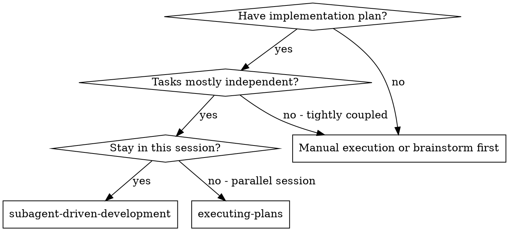
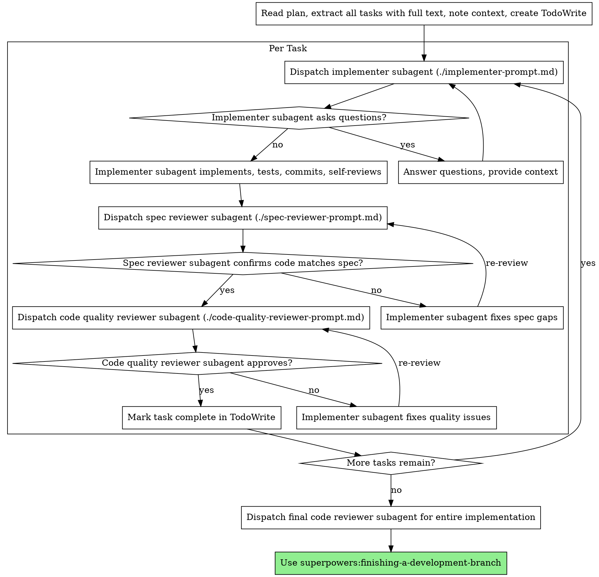

# 子 Agent 驱动开发

通过为每个任务派发一个全新的子 Agent 来执行计划；每项任务结束后进行两阶段审查：先审查规格符合性，再审查代码质量。

**为什么使用子 Agent：** 将任务委派给上下文相互隔离的专业 Agent。通过精确构造指令和上下文，确保它们保持专注并完成任务。它们绝不应继承当前会话的上下文或历史——你只为它们构造完成任务所需的内容。这也能保留你自己的上下文，用于协调工作。

**核心原则：** 每个任务使用全新的子 Agent + 两阶段审查（先规格，后质量）= 高质量、快速迭代。

**连续执行：** 不要在任务之间暂停并向人类协作者请示。持续执行计划中的所有任务，不要停下。只有三种理由可以停止：出现你无法解决的 BLOCKED 状态、存在确实阻止进展的歧义，或所有任务已完成。“要继续吗？”之类的询问和进度摘要只会浪费对方的时间——对方已经要求你执行计划，所以直接执行。

## 何时使用



**与 Executing Plans（并行会话）相比：**
- 保持在同一会话中（无上下文切换）
- 每个任务使用全新的子 Agent（无上下文污染）
- 每项任务后都进行两阶段审查：先规格符合性，后代码质量
- 迭代更快（任务之间无需人类参与）

## 流程



## 模型选择

为节省成本并提高速度，为每种角色选择足以胜任工作的最弱模型。

**机械性实施任务**（独立函数、规格清晰、涉及 1–2 个文件）：使用快速、低成本模型。计划规格充分时，大多数实施任务都是机械性的。

**集成与判断任务**（多文件协调、模式匹配、调试）：使用标准模型。

**架构、设计和审查任务：** 使用当前可用的最强模型。

**任务复杂度信号：**
- 涉及 1–2 个文件且规格完整 → 低成本模型
- 涉及多个文件并包含集成问题 → 标准模型
- 需要设计判断或广泛理解代码库 → 最强模型

## 处理实施者状态

实施子 Agent 会报告四种状态之一。应当分别正确处理：

**DONE：** 进入规格符合性审查。

**DONE_WITH_CONCERNS：** 实施者已完成工作，但标记了疑虑。继续前先阅读这些疑虑。如果疑虑涉及正确性或范围，应在审查前解决；如果只是观察结果（例如“这个文件越来越大”），记录后继续审查。

**NEEDS_CONTEXT：** 实施者需要未被提供的信息。补充缺失的上下文，然后重新派发。

**BLOCKED：** 实施者无法完成任务。评估阻塞原因：
1. 如果是上下文问题，补充上下文，并使用同一模型重新派发
2. 如果任务需要更强的推理能力，改用更强模型重新派发
3. 如果任务太大，将它拆成更小的部分
4. 如果计划本身错误，升级给人类处理

**绝不要**忽略升级请求，也不要在没有任何改变的情况下强迫同一模型重试。实施者表示被卡住时，说明某些条件必须改变。

## 提示词模板

- `./implementer-prompt.md`——派发实施子 Agent
- `./spec-reviewer-prompt.md`——派发规格符合性审查子 Agent
- `./code-quality-reviewer-prompt.md`——派发代码质量审查子 Agent

## 工作流示例

```
You: I'm using Subagent-Driven Development to execute this plan.

[Read plan file once: docs/superpowers/plans/feature-plan.md]
[Extract all 5 tasks with full text and context]
[Create TodoWrite with all tasks]

Task 1: Hook installation script

[Get Task 1 text and context (already extracted)]
[Dispatch implementation subagent with full task text + context]

Implementer: "Before I begin - should the hook be installed at user or system level?"

You: "User level (~/.config/superpowers/hooks/)"

Implementer: "Got it. Implementing now..."
[Later] Implementer:
  - Implemented install-hook command
  - Added tests, 5/5 passing
  - Self-review: Found I missed --force flag, added it
  - Committed

[Dispatch spec compliance reviewer]
Spec reviewer: ✅ Spec compliant - all requirements met, nothing extra

[Get git SHAs, dispatch code quality reviewer]
Code reviewer: Strengths: Good test coverage, clean. Issues: None. Approved.

[Mark Task 1 complete]

Task 2: Recovery modes

[Get Task 2 text and context (already extracted)]
[Dispatch implementation subagent with full task text + context]

Implementer: [No questions, proceeds]
Implementer:
  - Added verify/repair modes
  - 8/8 tests passing
  - Self-review: All good
  - Committed

[Dispatch spec compliance reviewer]
Spec reviewer: ❌ Issues:
  - Missing: Progress reporting (spec says "report every 100 items")
  - Extra: Added --json flag (not requested)

[Implementer fixes issues]
Implementer: Removed --json flag, added progress reporting

[Spec reviewer reviews again]
Spec reviewer: ✅ Spec compliant now

[Dispatch code quality reviewer]
Code reviewer: Strengths: Solid. Issues (Important): Magic number (100)

[Implementer fixes]
Implementer: Extracted PROGRESS_INTERVAL constant

[Code reviewer reviews again]
Code reviewer: ✅ Approved

[Mark Task 2 complete]

...

[After all tasks]
[Dispatch final code-reviewer]
Final reviewer: All requirements met, ready to merge

Done!
```

## 优势

**与手动执行相比：**
- 子 Agent 会自然地遵循 TDD
- 每个任务使用全新上下文（不会混淆）
- 适合并行环境（各子 Agent 互不干扰）
- 子 Agent 可以在工作前和工作过程中提出问题

**与 Executing Plans 相比：**
- 保持在同一会话中（无需交接）
- 持续推进（无需等待）
- 自动设置审查检查点

**效率收益：**
- 无需重复读取文件（控制者提供完整文本）
- 控制者精确筛选需要的上下文
- 子 Agent 一开始就获得完整信息
- 问题会在工作开始前暴露，而不是完成后才出现

**质量门：**
- 自我审查在交接前发现问题
- 两阶段审查：先规格符合性，后代码质量
- 审查循环确保修复确实有效
- 规格符合性防止少做或多做
- 代码质量审查确保实现质量可靠

**成本：**
- 子 Agent 调用更多（每项任务需要实施者和两名审查者）
- 控制者需要做更多准备工作（预先提取全部任务）
- 审查循环会增加迭代次数
- 但能更早发现问题，成本低于之后调试

## 危险信号

**绝不要：**
- 未经用户明确同意就在 main/master 分支上开始实施
- 跳过规格符合性或代码质量审查
- 在问题尚未修复时继续
- 并行派发多个实施子 Agent（会发生冲突）
- 让子 Agent 自己读取计划文件（应提供完整文本）
- 省略场景背景（子 Agent 必须理解任务的来龙去脉）
- 忽略子 Agent 的问题（回答后再让它继续）
- 接受规格符合性的“差不多”（规格审查者发现问题就表示尚未完成）
- 跳过复审循环（审查者发现问题 → 实施者修复 → 再次审查）
- 用实施者的自我审查替代真正的审查（两者都需要）
- **在规格符合性获得 ✅ 之前开始代码质量审查**（顺序错误）
- 任一审查仍有未解决问题时进入下一任务

**如果子 Agent 提出问题：**
- 清晰、完整地回答
- 必要时提供额外上下文
- 不要催促它进入实施阶段

**如果审查者发现问题：**
- 由实施者（同一个子 Agent）修复
- 审查者再次审查
- 重复直到批准
- 不要跳过复审

**如果子 Agent 未能完成任务：**
- 派发修复子 Agent，并提供具体指令
- 不要自己手动修复（会污染上下文）

## 集成

**必需的工作流技能：**
- **superpowers:using-git-worktrees**——确保工作区相互隔离（创建一个，或确认当前已隔离）
- **superpowers:writing-plans**——创建本技能要执行的计划
- **superpowers:requesting-code-review**——为审查子 Agent 提供代码审查模板
- **superpowers:finishing-a-development-branch**——在所有任务完成后结束开发工作

**子 Agent 应使用：**
- **superpowers:test-driven-development**——每个任务都由子 Agent 遵循 TDD

**替代工作流：**
- **superpowers:executing-plans**——需要在并行会话中执行而非同一会话时使用
