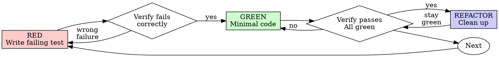

# 测试驱动开发（TDD）

## 概述

先写测试。观察它失败。再写最少代码使其通过。

**核心原则：** 如果没有亲眼看到测试失败，就不知道它是否测试了正确的内容。

**违背规则的字面要求，就是违背规则的根本精神。**

## 何时使用

**始终用于：**
- 新功能
- 缺陷修复
- 重构
- 行为变更

**例外情况（先询问你的人类协作者）：**
- 用完即弃的原型
- 生成的代码
- 配置文件

正在想“这次就跳过 TDD”？停止。这是在为自己找借口。

## 铁律

```
NO PRODUCTION CODE WITHOUT A FAILING TEST FIRST
```

在测试之前写了代码？删除它，重新开始。

**没有例外：**
- 不要将它保留为“参考”
- 不要在编写测试时“改造”它
- 不要再看它
- 删除就是删除

从测试出发重新实现。就这样。

## 红—绿—重构



### 红——编写失败测试

编写一个最小测试，展示应当发生的行为。

<Good>
```typescript
test('retries failed operations 3 times', async () => {
  let attempts = 0;
  const operation = () => {
    attempts++;
    if (attempts < 3) throw new Error('fail');
    return 'success';
  };

  const result = await retryOperation(operation);

  expect(result).toBe('success');
  expect(attempts).toBe(3);
});
```
名称清晰、测试真实行为、只验证一件事。
</Good>

<Bad>
```typescript
test('retry works', async () => {
  const mock = jest.fn()
    .mockRejectedValueOnce(new Error())
    .mockRejectedValueOnce(new Error())
    .mockResolvedValueOnce('success');
  await retryOperation(mock);
  expect(mock).toHaveBeenCalledTimes(3);
});
```
名称含糊，测试的是模拟对象而非代码。
</Bad>

**要求：**
- 一次只验证一种行为
- 名称清楚
- 使用真实代码（除非不可避免，否则不要使用模拟）

### 验证红——观察它失败

**强制要求，绝不能跳过。**

```bash
npm test path/to/test.test.ts
```

确认：
- 测试是断言失败，而不是运行出错
- 失败消息符合预期
- 失败原因是功能尚不存在，而不是拼写错误

**测试通过？** 你测试的是现有行为。修正测试。

**测试出错？** 修正错误并重新运行，直到它以正确方式失败。

### 绿——最少代码

编写能让测试通过的最简单代码。

<Good>
```typescript
async function retryOperation<T>(fn: () => Promise<T>): Promise<T> {
  for (let i = 0; i < 3; i++) {
    try {
      return await fn();
    } catch (e) {
      if (i === 2) throw e;
    }
  }
  throw new Error('unreachable');
}
```
只实现足以通过测试的内容。
</Good>

<Bad>
```typescript
async function retryOperation<T>(
  fn: () => Promise<T>,
  options?: {
    maxRetries?: number;
    backoff?: 'linear' | 'exponential';
    onRetry?: (attempt: number) => void;
  }
): Promise<T> {
  // YAGNI
}
```
过度设计。
</Bad>

不要添加功能、重构其他代码，也不要做超出测试要求的“改进”。

### 验证绿——观察它通过

**强制要求。**

```bash
npm test path/to/test.test.ts
```

确认：
- 当前测试通过
- 其他测试仍然通过
- 输出干净（没有错误或警告）

**测试失败？** 修正代码，不要修正测试。

**其他测试失败？** 立即修复。

### 重构——清理代码

只有在测试为绿之后才能：
- 消除重复
- 改进命名
- 提取辅助函数

始终保持测试为绿。不要添加新行为。

### 重复循环

为下一个功能编写下一个失败测试。

## 好测试

| 品质 | 好 | 差 |
|---------|------|-----|
| **最小化** | 只测一件事。名称里有“并且”？拆开。 | `test('validates email and domain and whitespace')` |
| **清晰** | 名称描述行为 | `test('test1')` |
| **表达意图** | 展示期望的 API | 掩盖代码应当做什么 |

## 为什么顺序很重要

**“我会在完成后补测试，验证代码有效”**

代码完成后才写的测试会立即通过。立即通过不能证明任何事情：
- 可能测错了内容
- 可能测试的是实现，而非行为
- 可能漏掉你忘记的边界情况
- 你从未见过它捕获缺陷

测试先行迫使你看到测试失败，从而证明它确实验证了某些内容。

**“我已经手动测试了所有边界情况”**

手动测试是临时随意的。你以为测试了全部内容，但实际上：
- 没有测试记录
- 代码改变后无法自动重跑
- 压力下很容易忘记案例
- “我试的时候能用” ≠ 完整验证

自动化测试是系统性的，每次都会以相同方式运行。

**“删除 X 小时的工作太浪费”**

这是沉没成本谬误。时间已经花掉。现在只有两种选择：
- 删除，并用 TDD 重写（再用 X 小时，获得高置信度）
- 保留，并事后补测试（30 分钟，低置信度，很可能有缺陷）

真正的“浪费”是保留无法信任的代码。没有真正测试的可运行代码就是技术债。

**“TDD 太教条，务实意味着灵活调整”**

TDD 本身就是务实方法：
- 提交前发现缺陷（比事后调试更快）
- 防止回归（测试能立即捕获破坏）
- 记录行为（测试展示代码用法）
- 支持重构（自由修改，测试捕获破坏）

所谓“务实”的捷径 = 在生产环境调试 = 更慢。

**“事后测试也能达到同样目标——重要的是精神，不是仪式”**

不。事后测试回答“这段代码做什么？”，测试先行回答“这段代码应当做什么？”

事后测试会受到实现偏差的影响。你测试的是自己已经构建的内容，而不是需求。你验证的是还记得的边界情况，而不是主动发现的边界情况。

测试先行迫使你在实现前发现边界情况。事后测试只能验证你记住了所有事情——而你并没有。

事后补 30 分钟测试 ≠ TDD。你获得了覆盖率，却失去了“测试确实有效”的证明。

## 常见的自我辩解

| 借口 | 事实 |
|--------|---------|
| “太简单，不值得测试” | 简单代码也会坏。测试只需 30 秒。 |
| “以后补测试” | 测试立即通过不能证明任何事情。 |
| “事后测试目标相同” | 事后测试 = “它做什么？”；测试先行 = “它应当做什么？” |
| “已经手动测过” | 临时测试 ≠ 系统测试。无记录，也无法重跑。 |
| “删除 X 小时的代码太浪费” | 沉没成本谬误。保留未经验证的代码才是技术债。 |
| “保留作参考，但先写测试” | 你会改造它。这仍是事后测试。删除就是删除。 |
| “需要先探索” | 可以。丢弃探索代码，然后从 TDD 开始。 |
| “代码难测 = 设计不清楚” | 听从测试的反馈。难以测试 = 难以使用。 |
| “TDD 会拖慢我” | TDD 比调试更快。务实 = 测试先行。 |
| “手动测试更快” | 手动测试无法证明边界情况；每次变更都得重新测试。 |
| “现有代码没有测试” | 你正在改进它。为现有代码补测试。 |

## 危险信号——停止并重新开始

- 在测试前写代码
- 实现后才写测试
- 测试立即通过
- 无法解释测试为何失败
- 测试“以后再加”
- 为“只破例这一次”找理由
- “我已经手动测试过”
- “事后测试也能达到同样目的”
- “重要的是精神，不是仪式”
- “保留作参考”或“改造现有代码”
- “已经花了 X 小时，删除太浪费”
- “TDD 太教条，我是在务实处理”
- “这次情况不同，因为……”

**以上任何情况都意味着：删除代码。从 TDD 重新开始。**

## 示例：缺陷修复

**缺陷：** 空电子邮件地址被接受。

**红**
```typescript
test('rejects empty email', async () => {
  const result = await submitForm({ email: '' });
  expect(result.error).toBe('Email required');
});
```

**验证红**
```bash
$ npm test
FAIL: expected 'Email required', got undefined
```

**绿**
```typescript
function submitForm(data: FormData) {
  if (!data.email?.trim()) {
    return { error: 'Email required' };
  }
  // ...
}
```

**验证绿**
```bash
$ npm test
PASS
```

**重构**
如有需要，为多个字段提取验证逻辑。

## 验证清单

将工作标记为完成之前：

- [ ] 每个新函数或方法都有测试
- [ ] 在实现之前亲眼看到每个测试失败
- [ ] 每个测试都因预期原因失败（功能缺失，而非拼写错误）
- [ ] 只编写使每个测试通过所需的最少代码
- [ ] 所有测试均通过
- [ ] 输出干净（没有错误或警告）
- [ ] 测试使用真实代码（只在无法避免时使用模拟）
- [ ] 覆盖边界情况和错误情况

无法勾选所有项目？你跳过了 TDD。重新开始。

## 遇到阻塞时

| 问题 | 解决方案 |
|---------|----------|
| 不知道如何测试 | 写出你希望存在的 API。先写断言。询问你的人类协作者。 |
| 测试过于复杂 | 设计过于复杂。简化接口。 |
| 所有内容都必须模拟 | 代码耦合过紧。使用依赖注入。 |
| 测试准备工作巨大 | 提取辅助函数。仍然复杂？简化设计。 |

## 与调试集成

发现缺陷？编写能够复现它的失败测试。遵循 TDD 循环。测试既能证明修复有效，也能防止回归。

绝不要在没有测试的情况下修复缺陷。

## 测试反模式

添加模拟或测试工具时，请阅读 @testing-anti-patterns.md，避免以下常见陷阱：
- 测试模拟对象的行为，而非真实行为
- 向生产类添加仅供测试的方法
- 尚未理解依赖就进行模拟

## 最终规则

```
Production code → test exists and failed first
Otherwise → not TDD
```

未经你的人类协作者许可，不得例外。
