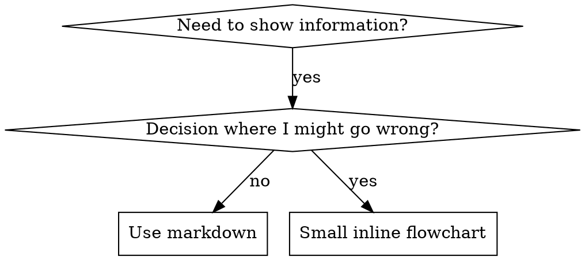

# 编写技能

## 概述

**编写技能，就是把测试驱动开发应用于流程文档。**

**个人技能位于各 Agent 专属目录中（Claude Code 使用 `~/.claude/skills`，Codex 使用 `~/.agents/skills/`）。**

先编写测试用例（通过子 Agent 构造压力场景），观察它们失败（基线行为），再编写技能（文档），观察测试通过（Agent 遵循指令），最后重构（堵住漏洞）。

**核心原则：** 如果没有亲眼看到 Agent 在缺少该技能时失败，就不知道这个技能是否教了正确的内容。

**必备背景：** 使用本技能前，必须理解 superpowers:test-driven-development。该技能定义了基本的红—绿—重构循环。本技能将 TDD 适配到文档领域。

**官方指南：** Anthropic 的官方技能编写最佳实践见 anthropic-best-practices.md。该文档提供额外模式和准则，用来补充本技能以 TDD 为中心的方法。

## 什么是技能？

**技能**是经过验证的技术、模式或工具的参考指南。技能帮助未来的 Claude 实例发现并应用有效方法。

**技能是：** 可复用的技术、模式、工具和参考指南。

**技能不是：** 关于你曾经如何解决某个问题的叙事。

## 技能的 TDD 映射

| TDD 概念 | 技能创建 |
|-------------|----------------|
| **测试用例** | 使用子 Agent 的压力场景 |
| **生产代码** | 技能文档（SKILL.md） |
| **测试失败（红）** | 没有技能时 Agent 违反规则（基线） |
| **测试通过（绿）** | 技能存在时 Agent 遵循规则 |
| **重构** | 在保持遵循的同时堵住漏洞 |
| **测试先行** | 编写技能之前先运行基线场景 |
| **观察失败** | 记录 Agent 使用的确切自我辩解 |
| **最少代码** | 只编写解决这些具体违规行为的技能内容 |
| **观察通过** | 验证 Agent 现在会遵循规则 |
| **重构循环** | 发现新借口 → 堵住漏洞 → 重新验证 |

整个技能创建过程都遵循红—绿—重构。

## 何时创建技能

**在以下情况创建：**
- 该技术对你而言并非直觉上显而易见
- 你会在不同项目中再次引用它
- 模式具有广泛适用性，而非项目专属
- 其他人也会从中受益

**不要为以下内容创建技能：**
- 一次性解决方案
- 已在其他地方充分记录的标准做法
- 项目专属约定（放入 CLAUDE.md）
- 机械性约束（如果能用正则或验证器强制执行，就自动化；把文档留给需要判断的事项）

## 技能类型

### 技术
需要按步骤执行的具体方法（condition-based-waiting、root-cause-tracing）。

### 模式
思考问题的方式（flatten-with-flags、test-invariants）。

### 参考
API 文档、语法指南、工具文档（Office 文档）。

## 目录结构


```
skills/
  skill-name/
    SKILL.md              # Main reference (required)
    supporting-file.*     # Only if needed
```

**扁平命名空间**——所有技能都位于同一个可搜索命名空间中。

**以下内容使用单独文件：**
1. **大型参考资料**（100 行以上）——API 文档、完整语法
2. **可复用工具**——脚本、实用程序、模板

**以下内容保留在正文中：**
- 原则和概念
- 代码模式（少于 50 行）
- 其他所有内容

## SKILL.md 结构

**Frontmatter（YAML）：**
- 两个必填字段：`name` 和 `description`（所有受支持字段见 [agentskills.io/specification](https://agentskills.io/specification)）
- 总计最多 1024 个字符
- `name`：只能使用字母、数字和连字符（不能使用括号或特殊字符）
- `description`：使用第三人称，并且只描述何时使用，而不是技能做什么
  - 以 “Use when...” 开头，聚焦触发条件
  - 包含具体症状、情形和上下文
  - **绝不要概述技能的过程或工作流**（原因见 CSO 一节）
  - 尽可能控制在 500 个字符以内

```markdown
---
name: Skill-Name-With-Hyphens
description: Use when [specific triggering conditions and symptoms]
---

# Skill Name

## Overview
What is this? Core principle in 1-2 sentences.

## When to Use
[Small inline flowchart IF decision non-obvious]

Bullet list with SYMPTOMS and use cases
When NOT to use

## Core Pattern (for techniques/patterns)
Before/after code comparison

## Quick Reference
Table or bullets for scanning common operations

## Implementation
Inline code for simple patterns
Link to file for heavy reference or reusable tools

## Common Mistakes
What goes wrong + fixes

## Real-World Impact (optional)
Concrete results
```


## Claude 搜索优化（CSO）

**发现能力至关重要：** 未来的 Claude 必须能够找到你的技能。

### 1. 信息丰富的 Description 字段

**目的：** Claude 通过 description 判断某项任务需要加载哪些技能。让它能够回答：“我现在是否应该阅读这个技能？”

**格式：** 以 “Use when...” 开头，聚焦触发条件。

**关键要求：Description = 何时使用，而不是技能做什么。**

Description 只应描述触发条件。不要在 description 中概述技能的过程或工作流。

**为什么这很重要：** 测试发现，当 description 概述技能工作流时，Claude 可能只遵循 description，而不阅读完整技能内容。例如，“在任务之间进行代码审查”的 description 会让 Claude 只进行一次审查，尽管技能流程图清楚展示了两次审查（先规格符合性，后代码质量）。

将 description 改为只写“在当前会话中执行由独立任务组成的实施计划时使用”（不概述工作流）后，Claude 会正确阅读流程图，并遵循两阶段审查过程。

**陷阱：** 概述工作流的 description 会制造一条 Claude 乐于采用的捷径。技能正文会变成 Claude 跳过的文档。

```yaml
# ❌ BAD: Summarizes workflow - Claude may follow this instead of reading skill
description: Use when executing plans - dispatches subagent per task with code review between tasks

# ❌ BAD: Too much process detail
description: Use for TDD - write test first, watch it fail, write minimal code, refactor

# ✅ GOOD: Just triggering conditions, no workflow summary
description: Use when executing implementation plans with independent tasks in the current session

# ✅ GOOD: Triggering conditions only
description: Use when implementing any feature or bugfix, before writing implementation code
```

**内容：**
- 使用能表明技能适用的具体触发条件、症状和情形
- 描述问题本身（竞态条件、行为不一致），而不是特定语言的症状（setTimeout、sleep）
- 除非技能本身与某项技术绑定，否则保持触发条件与技术无关
- 如果技能针对特定技术，请在触发条件中明确说明
- 使用第三人称（内容会被注入系统提示）
- **绝不要概述技能的过程或工作流**

```yaml
# ❌ BAD: Too abstract, vague, doesn't include when to use
description: For async testing

# ❌ BAD: First person
description: I can help you with async tests when they're flaky

# ❌ BAD: Mentions technology but skill isn't specific to it
description: Use when tests use setTimeout/sleep and are flaky

# ✅ GOOD: Starts with "Use when", describes problem, no workflow
description: Use when tests have race conditions, timing dependencies, or pass/fail inconsistently

# ✅ GOOD: Technology-specific skill with explicit trigger
description: Use when using React Router and handling authentication redirects
```

### 2. 关键词覆盖

使用 Claude 可能搜索的词：
- 错误消息：“Hook timed out”“ENOTEMPTY”“race condition”
- 症状：“flaky”“hanging”“zombie”“pollution”
- 同义词：“timeout/hang/freeze”“cleanup/teardown/afterEach”
- 工具：真实命令、库名称、文件类型

### 3. 描述性命名

**使用主动语态，以动词开头：**
- ✅ `creating-skills`，而不是 `skill-creation`
- ✅ `condition-based-waiting`，而不是 `async-test-helpers`

### 4. Token 效率（关键）

**问题：** getting-started 和经常引用的技能会加载到每一次对话中。每个 token 都有成本。

**目标词数：**
- getting-started 工作流：每个少于 150 词
- 经常加载的技能：总计少于 200 词
- 其他技能：少于 500 词（仍需保持简洁）

**技术：**

**把细节移到工具帮助中：**
```bash
# ❌ BAD: Document all flags in SKILL.md
search-conversations supports --text, --both, --after DATE, --before DATE, --limit N

# ✅ GOOD: Reference --help
search-conversations supports multiple modes and filters. Run --help for details.
```

**使用交叉引用：**
```markdown
# ❌ BAD: Repeat workflow details
When searching, dispatch subagent with template...
[20 lines of repeated instructions]

# ✅ GOOD: Reference other skill
Always use subagents (50-100x context savings). REQUIRED: Use [other-skill-name] for workflow.
```

**压缩示例：**
```markdown
# ❌ BAD: Verbose example (42 words)
your human partner: "How did we handle authentication errors in React Router before?"
You: I'll search past conversations for React Router authentication patterns.
[Dispatch subagent with search query: "React Router authentication error handling 401"]

# ✅ GOOD: Minimal example (20 words)
Partner: "How did we handle auth errors in React Router?"
You: Searching...
[Dispatch subagent → synthesis]
```

**消除冗余：**
- 不要重复交叉引用技能中已有的内容
- 不要解释从命令本身就能看明白的内容
- 不要为同一模式提供多个示例

**验证：**
```bash
wc -w skills/path/SKILL.md
# getting-started workflows: aim for <150 each
# Other frequently-loaded: aim for <200 total
```

**按你要做的事情或核心洞见命名：**
- ✅ `condition-based-waiting` > `async-test-helpers`
- ✅ `using-skills`，而不是 `skill-usage`
- ✅ `flatten-with-flags` > `data-structure-refactoring`
- ✅ `root-cause-tracing` > `debugging-techniques`

**动名词（-ing）很适合表示流程：**
- `creating-skills`、`testing-skills`、`debugging-with-logs`
- 主动，能够描述正在执行的动作

### 4. 交叉引用其他技能

**编写引用其他技能的文档时：**

只使用技能名称，并加上明确的要求标记：
- ✅ 正确：`**REQUIRED SUB-SKILL:** Use superpowers:test-driven-development`
- ✅ 正确：`**REQUIRED BACKGROUND:** You MUST understand superpowers:systematic-debugging`
- ❌ 错误：`See skills/testing/test-driven-development`（不清楚是否为必需）
- ❌ 错误：`@skills/testing/test-driven-development/SKILL.md`（强制加载并消耗上下文）

**为什么不使用 @ 链接：** `@` 语法会立即强制加载文件，在真正需要之前就消耗 20 万以上的上下文。

## 流程图的使用



**只在以下情况使用流程图：**
- 不明显的决策点
- 可能过早停止的流程循环
- “何时使用 A、何时使用 B”的决策

**绝不要将流程图用于：**
- 参考资料 → 使用表格或列表
- 代码示例 → 使用 Markdown 代码块
- 线性指令 → 使用有序列表
- 没有语义的标签（step1、helper2）

Graphviz 样式规则见 @graphviz-conventions.dot。

**为你的人类协作者可视化：** 使用本目录中的 `render-graphs.js` 将技能流程图渲染为 SVG：
```bash
./render-graphs.js ../some-skill           # Each diagram separately
./render-graphs.js ../some-skill --combine # All diagrams in one SVG
```

## 代码示例

**一个出色示例胜过许多平庸示例。**

选择最相关的语言：
- 测试技术 → TypeScript/JavaScript
- 系统调试 → Shell/Python
- 数据处理 → Python

**好示例应当：**
- 完整且可以运行
- 有完善注释解释为什么这样做
- 来自真实场景
- 清楚展示模式
- 可以直接调整使用，而不是通用空模板

**不要：**
- 使用 5 种以上语言实现
- 创建填空模板
- 编写生造的示例

你很擅长移植——一个优秀示例就足够了。

## 文件组织

### 自包含技能
```
defense-in-depth/
  SKILL.md    # Everything inline
```
适用情况：所有内容都能容纳在正文中，不需要大型参考资料。

### 带可复用工具的技能
```
condition-based-waiting/
  SKILL.md    # Overview + patterns
  example.ts  # Working helpers to adapt
```
适用情况：工具是可复用代码，而不只是叙述。

### 带大型参考资料的技能
```
pptx/
  SKILL.md       # Overview + workflows
  pptxgenjs.md   # 600 lines API reference
  ooxml.md       # 500 lines XML structure
  scripts/       # Executable tools
```
适用情况：参考资料太大，不适合放在正文中。

## 铁律（与 TDD 相同）

```
NO SKILL WITHOUT A FAILING TEST FIRST
```

这条规则同时适用于新技能和对现有技能的编辑。

测试前编写技能？删除它，重新开始。
未经测试就编辑技能？同样违反规则。

**没有例外：**
- “简单补充”也不能例外
- “只增加一个章节”也不能例外
- “文档更新”也不能例外
- 不要把未经测试的变更保留为“参考”
- 不要在运行测试时“改造”它们
- 删除就是删除

**必备背景：** superpowers:test-driven-development 技能解释了这条规则为什么重要。同样的原则也适用于文档。

## 测试所有类型的技能

不同技能类型需要不同的测试方法：

### 强制纪律的技能（规则／要求）

**示例：** TDD、verification-before-completion、designing-before-coding。

**测试方式：**
- 学术问题：Agent 是否理解规则？
- 压力场景：Agent 在压力下是否仍会遵循？
- 组合多种压力：时间 + 沉没成本 + 疲惫
- 识别自我辩解，并添加明确反制措施

**成功标准：** Agent 在最大压力下仍遵循规则。

### 技术型技能（操作指南）

**示例：** condition-based-waiting、root-cause-tracing、defensive-programming。

**测试方式：**
- 应用场景：Agent 能否正确应用该技术？
- 变化场景：Agent 能否处理边界情况？
- 缺失信息测试：指令中是否存在缺口？

**成功标准：** Agent 能够把技术成功应用于新场景。

### 模式型技能（思维模型）

**示例：** reducing-complexity、information-hiding 概念。

**测试方式：**
- 识别场景：Agent 能否识别该模式何时适用？
- 应用场景：Agent 能否使用该思维模型？
- 反例：Agent 是否知道何时不应应用？

**成功标准：** Agent 能正确识别何时以及如何应用该模式。

### 参考型技能（文档／API）

**示例：** API 文档、命令参考、库指南。

**测试方式：**
- 检索场景：Agent 能否找到正确的信息？
- 应用场景：Agent 能否正确使用找到的信息？
- 缺口测试：是否覆盖常见用例？

**成功标准：** Agent 能找到并正确应用参考信息。

## 跳过测试时常见的自我辩解

| 借口 | 事实 |
|--------|---------|
| “技能显然很清楚” | 对你清楚 ≠ 对其他 Agent 清楚。测试它。 |
| “它只是参考资料” | 参考资料可能有缺口或含糊章节。测试检索。 |
| “测试有些小题大做” | 未测试技能总会有问题。15 分钟测试能节省数小时。 |
| “出现问题后再测试” | 出现问题 = Agent 已经无法使用技能。部署前测试。 |
| “测试太繁琐” | 测试没有在生产环境调试坏技能繁琐。 |
| “我相信它很好” | 过度自信必然导致问题。仍要测试。 |
| “学术审查已经够了” | 阅读 ≠ 使用。测试应用场景。 |
| “没时间测试” | 部署未经测试的技能会在之后浪费更多修复时间。 |

**以上全部意味着：部署前进行测试。没有例外。**

## 防止技能被自我辩解击穿

强制纪律的技能（例如 TDD）需要抵御自我辩解。Agent 很聪明，在压力下会寻找漏洞。

**心理学说明：** 理解说服技术为什么有效，有助于系统化应用它们。有关权威、承诺、稀缺性、社会认同和统一性原则的研究基础（Cialdini，2021；Meincke 等，2025），见 persuasion-principles.md。

### 明确堵住每个漏洞

不要只陈述规则——还要禁止具体的绕过方式：

<Bad>
```markdown
Write code before test? Delete it.
```
</Bad>

<Good>
```markdown
Write code before test? Delete it. Start over.

**No exceptions:**
- Don't keep it as "reference"
- Don't "adapt" it while writing tests
- Don't look at it
- Delete means delete
```
</Good>

### 回应“精神与字面”之争

尽早加入基本原则：

```markdown
**Violating the letter of the rules is violating the spirit of the rules.**
```

这会封堵“我遵循的是精神”这一整类自我辩解。

### 建立自我辩解表

收集基线测试中的自我辩解（见下方测试章节）。Agent 提出的每个借口都应进入表格：

```markdown
| Excuse | Reality |
|--------|---------|
| "Too simple to test" | Simple code breaks. Test takes 30 seconds. |
| "I'll test after" | Tests passing immediately prove nothing. |
| "Tests after achieve same goals" | Tests-after = "what does this do?" Tests-first = "what should this do?" |
```

### 创建危险信号清单

让 Agent 能够轻松自查是否正在为自己找借口：

```markdown
## Red Flags - STOP and Start Over

- Code before test
- "I already manually tested it"
- "Tests after achieve the same purpose"
- "It's about spirit not ritual"
- "This is different because..."

**All of these mean: Delete code. Start over with TDD.**
```

### 为违规症状更新 CSO

在 description 中加入你将要违反规则时出现的症状：

```yaml
description: use when implementing any feature or bugfix, before writing implementation code
```

## 技能的红—绿—重构

遵循 TDD 循环：

### 红：编写失败测试（基线）

在没有技能的情况下，让子 Agent 运行压力场景。记录确切行为：
- 它作出了哪些选择？
- 它用了哪些自我辩解（逐字记录）？
- 哪些压力触发了违规？

这就是“观察测试失败”——编写技能前，必须亲眼看到 Agent 自然会怎样做。

### 绿：编写最小技能

只编写针对这些具体自我辩解的技能内容。不要为假想情况添加额外内容。

在存在技能的情况下运行相同场景。Agent 现在应当遵循要求。

### 重构：堵住漏洞

Agent 找到了新的借口？添加明确反制措施。重新测试，直到技能牢不可破。

**测试方法：** 完整测试方法见 @testing-skills-with-subagents.md：
- 如何编写压力场景
- 压力类型（时间、沉没成本、权威、疲惫）
- 系统化堵住漏洞
- 元测试技术

## 反模式

### ❌ 叙事式示例
“在 2025-10-03 的会话中，我们发现空 projectDir 导致……”
**为什么不好：** 过于具体，无法复用。

### ❌ 多语言稀释
example-js.js、example-py.py、example-go.go
**为什么不好：** 质量平庸，增加维护负担。

### ❌ 在流程图中放代码
```dot
step1 [label="import fs"];
step2 [label="read file"];
```
**为什么不好：** 无法复制粘贴，难以阅读。

### ❌ 通用标签
helper1、helper2、step3、pattern4
**为什么不好：** 标签应具有明确语义。

## 停止：进入下一个技能之前

**编写任何技能后，都必须停止并完成部署过程。**

**不要：**
- 批量创建多个技能而不逐个测试
- 当前技能尚未验证就进入下一个技能
- 因为“批处理更高效”而跳过测试

**下面的部署清单对每个技能都是强制要求。**

部署未经测试的技能 = 部署未经测试的代码。这违反质量标准。

## 技能创建清单（TDD 适配版）

**重要：使用 TodoWrite 为下面每个清单项创建待办事项。**

**红阶段——编写失败测试：**
- [ ] 创建压力场景（纪律型技能组合 3 种以上压力）
- [ ] 在没有技能时运行场景——逐字记录基线行为
- [ ] 识别自我辩解和失败中的模式

**绿阶段——编写最小技能：**
- [ ] 名称只使用字母、数字和连字符（无括号或特殊字符）
- [ ] YAML frontmatter 包含必填的 `name` 和 `description` 字段（最多 1024 个字符；见[规范](https://agentskills.io/specification)）
- [ ] Description 以 “Use when...” 开头，并包含具体触发条件或症状
- [ ] Description 使用第三人称
- [ ] 正文包含用于搜索的关键词（错误、症状、工具）
- [ ] 概述清楚，并提供核心原则
- [ ] 处理红阶段发现的具体基线失败
- [ ] 代码放在正文中，或链接到单独文件
- [ ] 提供一个出色示例，而不是多语言示例
- [ ] 在存在技能时运行场景——验证 Agent 现在会遵循

**重构阶段——堵住漏洞：**
- [ ] 识别测试中出现的新自我辩解
- [ ] 添加明确反制措施（纪律型技能）
- [ ] 根据所有测试迭代建立自我辩解表
- [ ] 创建危险信号清单
- [ ] 重新测试，直到牢不可破

**质量检查：**
- [ ] 只有决策不明显时才使用小型流程图
- [ ] 快速参考表
- [ ] 常见错误章节
- [ ] 不使用叙事式故事
- [ ] 支持文件只用于工具或大型参考资料

**部署：**
- [ ] 将技能提交到 git，并推送到你的 fork（如果已经配置）
- [ ] 如果具有广泛用途，考虑通过 PR 贡献回上游

## 发现工作流

未来的 Claude 通过以下方式找到技能：

1. **遇到问题**（“测试不稳定”）
3. **找到技能**（description 匹配）
4. **浏览概述**（是否相关？）
5. **阅读模式**（快速参考表）
6. **加载示例**（仅在实施时）

**针对这一流程进行优化**——尽早并频繁放置可搜索的术语。

## 结论

**创建技能，就是把 TDD 应用于流程文档。**

同一条铁律：没有失败测试，就不能创建技能。
同一个循环：红（基线）→ 绿（编写技能）→ 重构（堵住漏洞）。
同样的收益：质量更高、意外更少、结果牢不可破。

如果你对代码遵循 TDD，也应当对技能遵循 TDD。它们只是把同一套纪律应用到文档领域。
